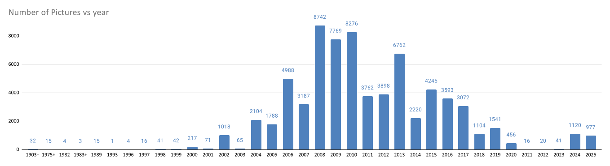

# Bilder

Support tool to organize and categorize my image collection.

## Rationale

I store my images sorted by years, with a folder for each year. Inside these folders there are subfolders for each event. The name style of these subfolders is `MMDD_Description_of_the_Event`. The pictures of a visit to Shanghai on the first of August in 2024 would therefore be in the folder `/2024/0801_Shanghai/`.

The goal for the `investigate.py` app is therefore to scan the folders with the years, and create a `.csv` file with colums for all folders, the number of subfolders, number of files, and total size of the folder.

A later `investigate_events.py` will be more verbose about the events. Since the folder name structure is defined the events can be named (with removing the _ characters) and the correct month and day of the event.

## October 2024

In Shanghai I had several ideas, and made it actually work later in Saigon. The `csv` file was created with the intended informations.

## October 2025

Now in Phnom Penh three more requirements emerged:

- Have it run automaically periodically (once a month) on the diskstation to have an updated overview automatically
- Combine all the .csv files into one larger `.xlsx` file with Tabs for each year, and probably one "overview" tab
- Check folder names to have `underscore_between_the_text` for compatibility, but have the csv file with a column just Text

Each csv could there fore have date (4 digits), event and folder, files, subfolders

While at it, the `/photo` should be read only, and be populated with copy/paste from `/sCloud/xchange/bilder` folder 

## Diskstation DS216+ II

Since my Diskstation DS215j was not easily accessed over the internet and 10,000 km away I started with a local NAS as Diskstation DS216+II with 8 GB RAM in 2017. By 2026 I had collected 71225 pictures (149.65 GByte):

Now let's organize them!

## iCloud

Like the best camera is the one you have with you, the best pictures are the ones you can share. And in many cases that is your phone with you. In January 2026 I discovered that I can access my iCloud photo library with python. Now I can automate my image organizing project, if I ever find the time to write these scripts. 

Current count: 28,548 items

## Google Photos

Since October 2013 I started using my second phone (Android) not just for teaching but also to take photos. Should also be consilidated with the Diskstation summary.

The Dashboard shows more than 4000 photos.
